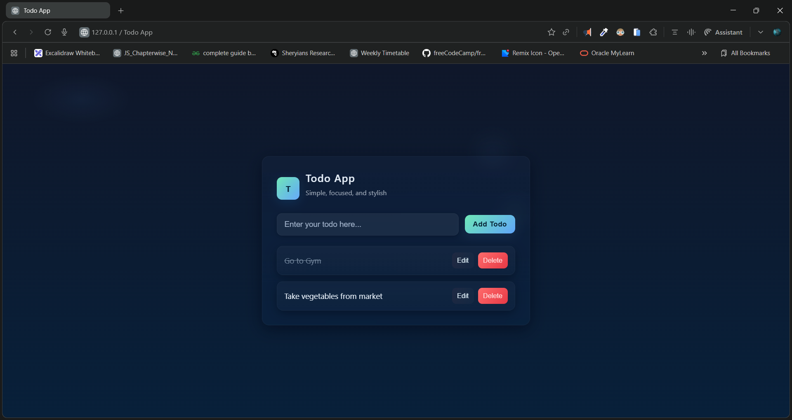

# 🌟 Todo App — Simple, Stylish & Fast

A beautifully designed **Todo App** built with **HTML, CSS, and JavaScript**, featuring smooth UI, localStorage support, editing, deleting, and task completion.

---

## 🚀 Live Demo

- 🔗 **Live Website:** []()
- 🎥 **Demo Video:** [click to watch](./demo.mp4)

---

## ✨ Features

* 📝 Add new todos easily
* ✏️ Edit existing tasks inline
* ✔️ Mark tasks as completed
* 🗑️ Delete tasks instantly
* 💾 Saves automatically using **localStorage**
* 🎨 Modern glassmorphism UI
* ⚡ Smooth animations & responsive design

---

## 📸 Preview




---

## 📁 Project Structure

```
📦 Todo-App
 ┣ 📜 index.html        → App structure
 ┣ 📜 style.css         → Stylish UI and animations
 ┗ 📜 script.js         → Todo logic & localStorage handling
```

---

## 🛠️ Technologies Used

* **HTML5**
* **CSS3 (Glassmorphism, gradients, shadows)**
* **Vanilla JavaScript**
* **LocalStorage**

---

## ⚙️ Installation

Clone the repository:

```bash
git clone 
```

Open the project folder:

```bash
cd todo-app
```

Run the app by simply opening **index.html** in your browser.

---

## 🎯 How it Works

* Type your todo and hit **Enter** or click **Add Todo**
* Click the todo text to toggle **completed**
* Click **Edit** to modify the todo in place
* Click **Delete** to remove a todo
* All changes persist automatically

---

## 📌 Future Enhancements

* Dark/light mode toggle
* Filters (All, Completed, Pending)
* Animations for add/remove
* Drag & drop ordering

---

## 🧑‍💻 Author

Made with ❤️ by **Dileep kumawat**
- 📧 [dileepkumawat525@gmail.com](mailto:dileepkumawat525@gmail.com)
- 🔗 [LinkedIn](https://www.linkedin.com/in/dileep-kumawat/)